# Cochlea-Inspired Spiking Neural Networks for Robust Pitch Perception

This repository explores the noise-robustness of temporal coding in auditory
perception using Spiking Neural Networks (SNNs). It implements a biological
auditory front-end (Gammatone filterbank + Inner Hair Cell model + Poisson
encoding) and routes the resulting spike trains into PyTorch-based SNNs built
with `snnTorch` (surrogate-gradient supervised learning and unsupervised
STDP-WTA).

Built as a course project on Neuromorphic Computing (Skoltech), and developed
further as a self-contained research repo for the Computational Neuroscience
winter school (Göttingen). The long-term goal is a bio-plausible *absolute
pitch* model: rather than a flat 88-way classifier, learn a **compressed,
octave-invariant pitch-class (chroma) representation**
(see [`docs/ABSOLUTE_PITCH.md`](docs/ABSOLUTE_PITCH.md)).

## Hypothesis → Experiments → Conclusions

### Hypothesis

> Temporal coding — phase-locking of cochlear spikes to the stimulus period —
> is inherently more noise-robust than pure rate coding, and the place (tonotopic)
> + temporal structure of a gammatone/IHC front-end contains the information
> needed to separate the *absolute height* (register) of a note from its
> *pitch class* (chroma). If so, a 12-unit chroma + 8-unit register code should
> reproduce the full 88-note classification of a flat classifier with far fewer
> output units — a compressed, "absolute pitch" representation.

### What the project does

1. **Simulates the cochlea** — raw audio (pure tones) is passed through a
   4th-order Gammatone filterbank whose channel frequencies are spaced on
   bio-accurate Equivalent Rectangular Bandwidth (ERB) scales, then through a
   simple Inner Hair Cell (IHC) model (half-wave rectification + power-law
   compression), and encoded into spike trains via an inhomogeneous Poisson
   process.
2. **Encodes audio into spikes** with one of two interchangeable front-ends:
   - `handy` — a fully hand-rolled front-end (`src/preprocess.py`), including
     three ERB-rate scale implementations.
   - `spikify` — the `spikify` library's `FilterBank` + Poisson rate encoder.
3. **Classifies pitch with an SNN** under two learning paradigms:
   - *Supervised surrogate-gradient* training (`PitchSNN`, membrane-potential
     logits averaged over time).
   - *Unsupervised Spike-Timing-Dependent Plasticity* with Winner-Take-All
     lateral inhibition (`STDPWTA`, classical pair-based STDP + homeostatic
     weight normalization).
4. **Quantifies noise robustness** by sweeping SNR from +20 dB down to −10 dB
   and measuring classification accuracy.

The full pipeline is presented in the course report,
[`docs/CourseFinalReport.pdf`](docs/CourseFinalReport.pdf).

## Experiment 1 — Cochlear front-end and the ERB scaling bug

Before any network can learn pitch, the filterbank must route each tone to the
right cochlear channels. Three ERB-rate scales (`LinearERB`, `QuadERB`,
`VoiceboxERB`) are placed on the standard perceptual frequency axis
(round-trip validated, `inv(call(f))≈f`).

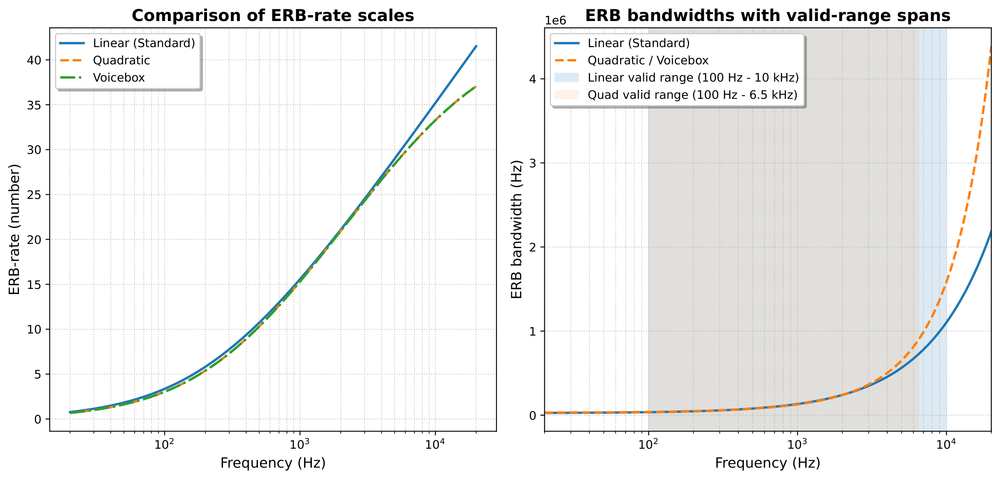

**Discovery:** the Quadratic and Linear ERB inverse mappings returned values
scaled by 1000 (Hz vs kHz), misplacing center frequencies and destroying
phase-locking. After the fix, filterbank channels lock to the tone period and
activation concentrates on frequency-appropriate channels (handy = custom,
fixed; library = spikify reference):

| Handy (buggy)               | Handy (fixed)              | Spikify (library)          |
|-----------------------------|----------------------------|----------------------------|
| 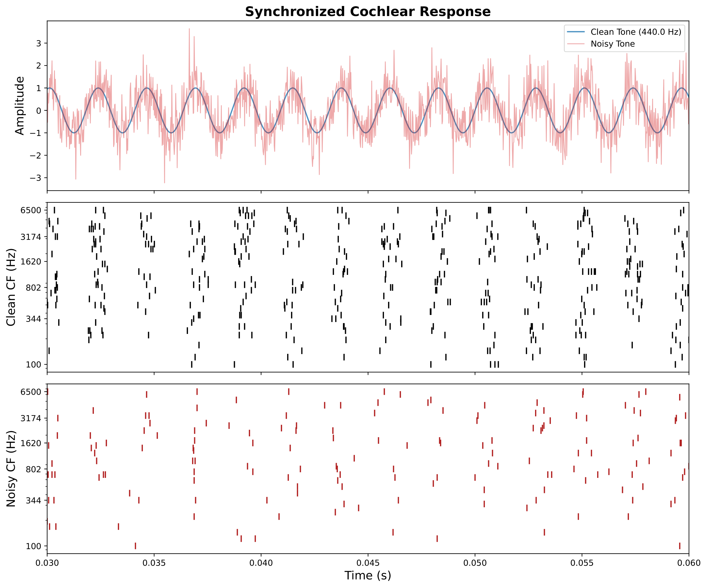 | 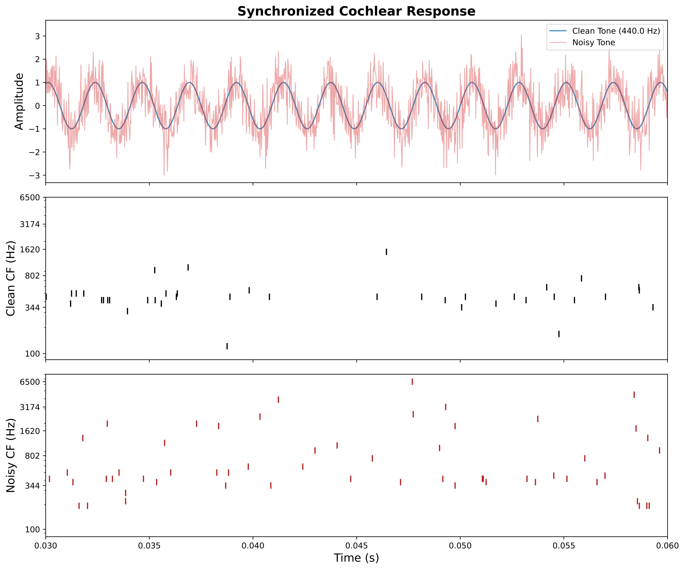 | 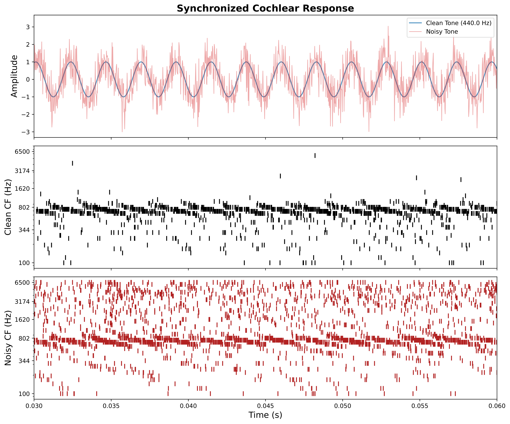 |

**Conclusion:** the `handy` front-end's *relative thresholding and global
normalization* preserve temporal structure better than the library baseline,
producing clearer phase-locking (key for noise immunity and stable,
low-frequency perception).

## Experiment 2 — Noise robustness and 3-note classification

The supervised `PitchSNN` (50 → 100 LIF → 3) is trained on C4/A4/A5 and tested
under additive white noise from +20 dB to −10 dB SNR:

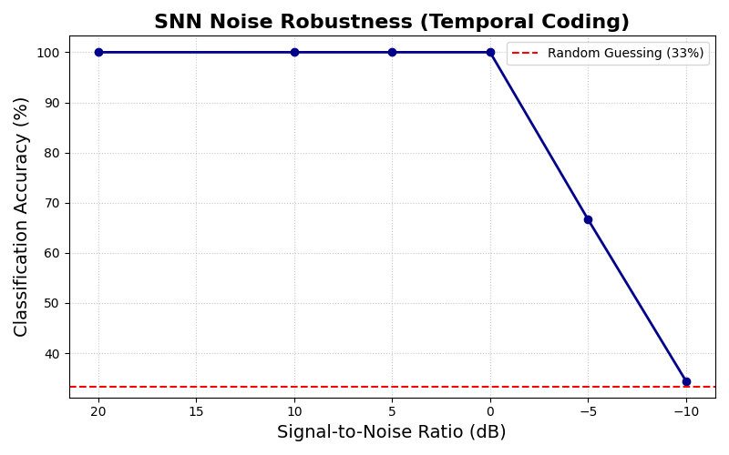

**Results:**
- 100% accuracy on the 3-tone task (both front-ends, after the ERB fix).
- `handy` preprocessing degrades **gracefully** (stable at negative SNR);
  `spikify` trains faster but becomes **unstable at low SNR**.

**Conclusion:** the handy front-end's relative rate scaling (global max
normalization) preserves the temporal coincidences required for robust
phase-locked detection in noise.

## Experiment 3 — Full 88-key piano classification

The same architecture is scaled to all **88 piano keys (A0 27.5 Hz → C8
4186 Hz)**, 50 samples/key, 1 ms-binned spike tensors.

| Handy                     | Spikify                   |
|---------------------------|---------------------------|
| 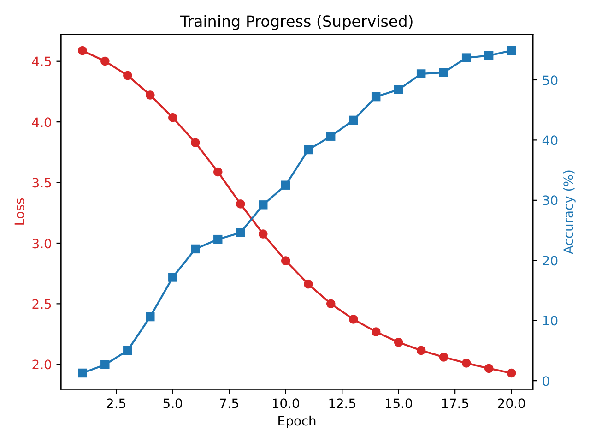 | 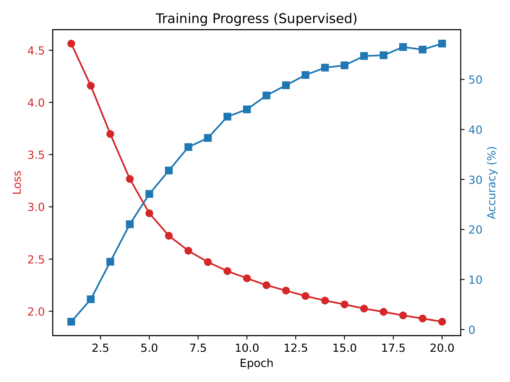 |

**Results:** ~58% test accuracy for both front-ends. Errors are highly
structured: the model confuses notes *within the same pitch class across
octaves* (C4 ↔ C5) much more than chromatic neighbours, and
**low-frequency notes are hardest** — handy stays accurate from B2, spikify
only from F3.

| Handy confusion matrix |
|------------------------|
| 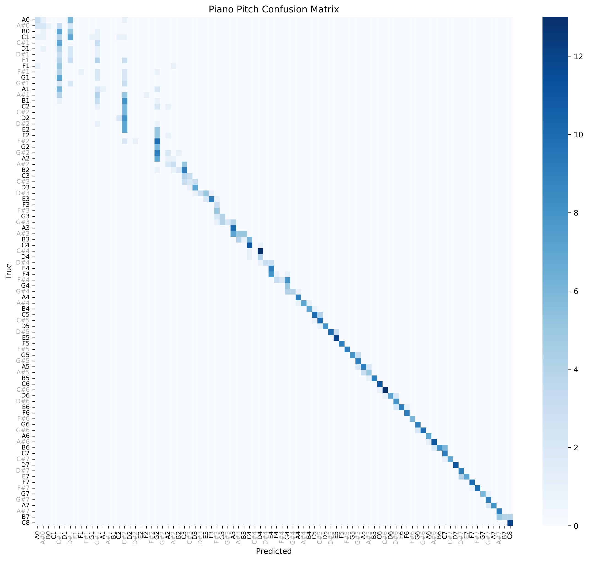 |

**Conclusion:** a flat 88-way readout wastes capacity; the model is
*implicitly* learning octave-equivalent pitch classes. This motivates
compressing the output axis (experiment 5).

## Experiment 4 — Unsupervised STDP-WTA learning

A classical pair-based STDP layer with lateral Winner-Take-All inhibition
(τ=20 ms, homeostatic L2 normalization) is trained without labels on the
piano spike trains; neurons are later assigned to classes by majority vote.

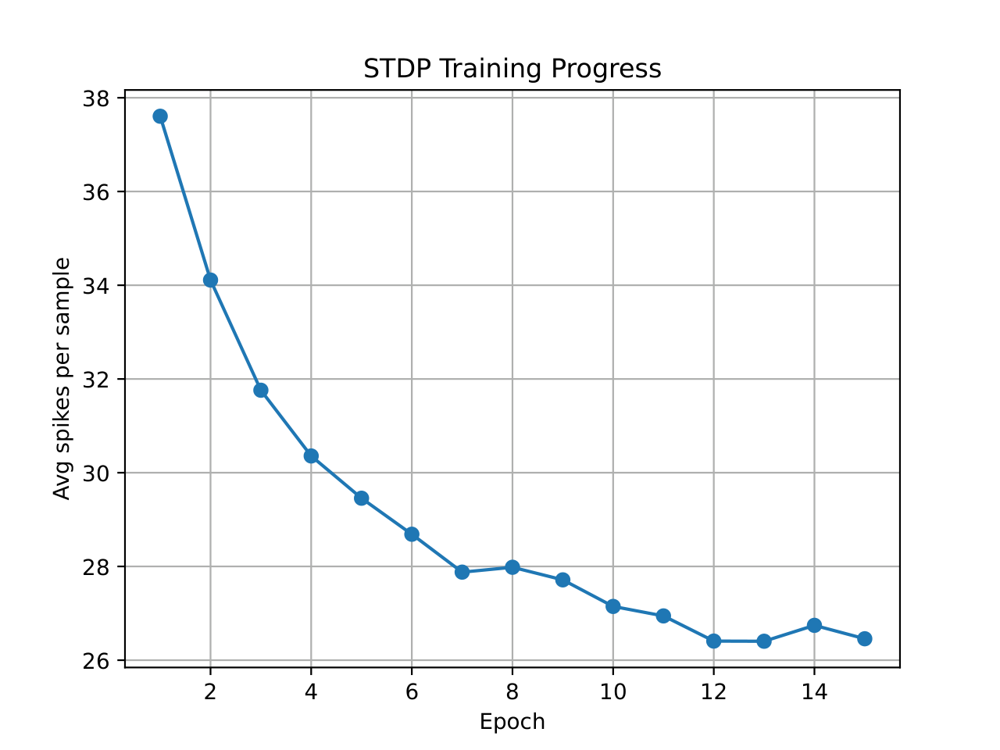

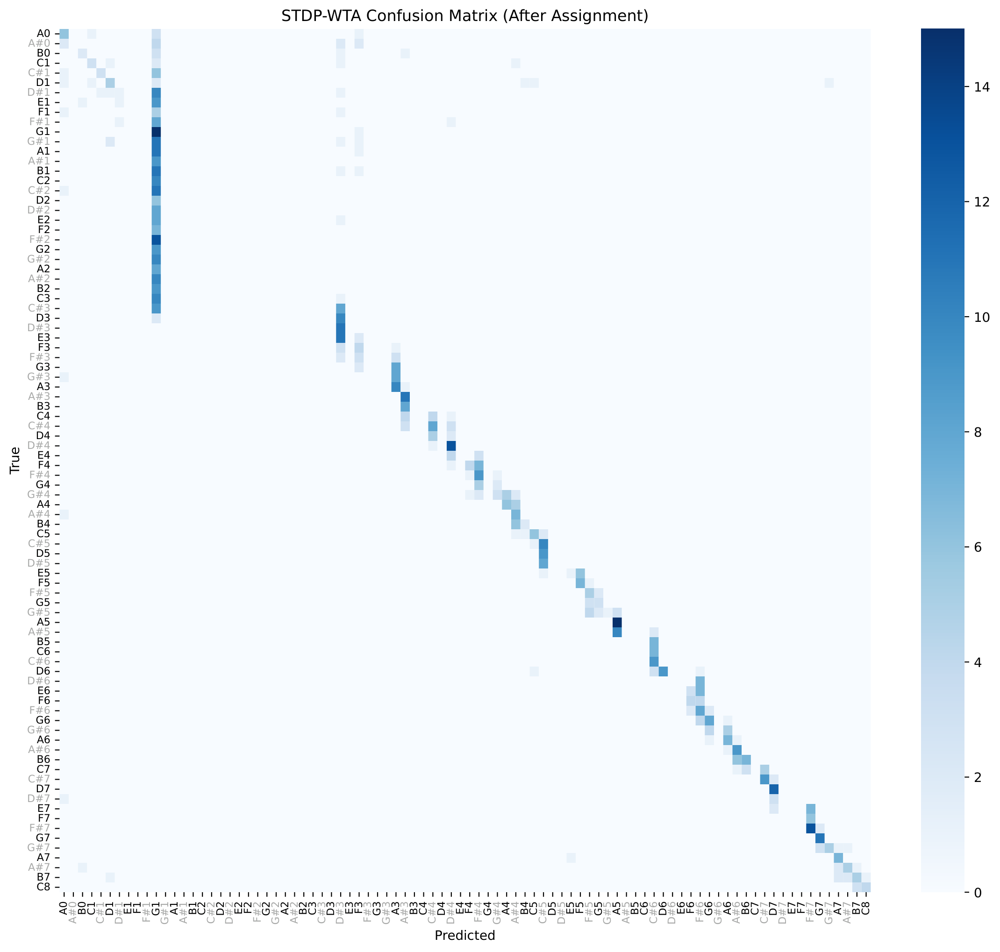

**Results:** weight selectivity emerges without supervision; handy-front-end
learning is **stable** with *structured* (octave-related) errors, whereas
spikify fluctuates and produces diffuse misclassifications.

**Conclusion:** STDP + WTA can discover pitch-selective neurons from cochlear
timing alone, and the quality of the learned selectivity inherits the temporal
fidelity of the front-end.

## Experiment 5 — Toward "absolute pitch": compressed chroma/register code

Replace the 88-class head with two small, interpretable axes:

```
register r = k // 12   (0..7)        pitch class (chroma) c = k % 12
k = r * 12 + c                       # 88 notes encoded by 12 + 8 = 20 units
```

Implemented in [`experiments/absolute_pitch.py`](experiments/absolute_pitch.py)
(design and full results in [`docs/ABSOLUTE_PITCH.md`](docs/ABSOLUTE_PITCH.md)).

| Experiment | Chance | Result | Meaning |
|-----------|--------|--------|---------|
| `chroma_full` (12 units, all 88 notes) | 8.3% | **47.4%** test chroma | 12 units retain most of the pitch-class info of the flat 88-way model |
| `chroma_transfer` (trained on C4–B4 only) | 8.3% | **32.5%** same-octave held-out; **83–100%** transfer upward | octave equivalence generalizes upward; collapses below the 100 Hz filterbank floor |
| `chroma_register` (12 + 8 = 20 units) | 1.1% | **48.8%** reconstructed note | register head 93.5% (height is easy), chroma head 49.8% (class is the bottleneck) |
| `probe` (hidden LIF code) | 8.3% | **31.0%** chroma purity | the SNN's population code is partially organized by pitch class |

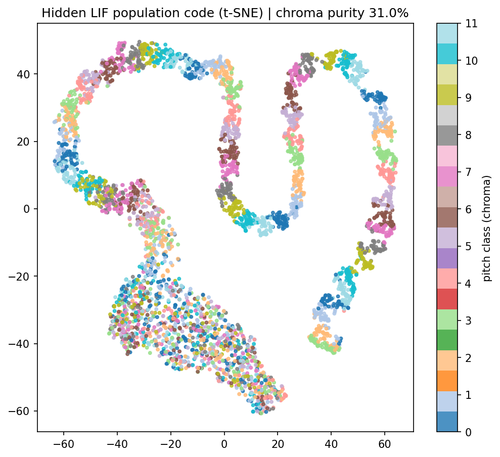

**Conclusions**
- **Compression works:** 20 units reproduce ~49% of the exact-note task,
  nearly matching the flat 88-way model's ~58% with 1/4 of the output neurons,
  and with *interpretable* axes (register vs chroma).
- **Absolute-pitch height is easy, pitch class is hard:** the register head
  reaches 94%, the chroma head only 50%.
- **Octave equivalence is real and asymmetric:** pitch-class transfer is
  ~100% *above* the trained octave but zero below the front-end's spectral
  floor — absolute pitch can only generalize within cochlear coverage.
- **The flat model already encodes octave structure:** its rare mistakes are
  almost all same-chroma, octave-confused notes.

## TODO — absolute-pitch experiments (current state)

- [x] `chroma_full` — 12-unit chroma on all 88 notes → **47.4%** (handy)
- [x] `chroma_transfer` — single-octave training → upward transfer 83–100% (handy)
- [x] `chroma_register` — 12+8 heads → 48.8% reconstructed note (handy)
- [x] `probe` — hidden-code chroma purity 31% + t-SNE (handy)
- [ ] Repeat the four experiments on the `spikify` dataset (front-end comparison)
- [ ] Longer training / LR schedule for the chroma head (>50% target)
- [ ] Add tuned filterbank density at low frequencies; test if the <100 Hz transfer collapse is recoverable
- [ ] Channel-shift octave augmentation (tonotopic translation invariance)
- [ ] Latency vs. place-coding attribution (which channels drive the chroma head)
- [ ] STDP chroma layer — 12-neuron WTA on pitch-class labels
- [ ] Weight-dependent ("long-term") STDP variant with saturating weights
- [ ] Prepare the updated results figures for the winter-school report

## Installation

This project uses `uv` for lightning-fast Python package management.

1. Install `uv` if you haven't already:
   ```bash
   curl -LsSf https://astral.sh/uv/install.sh | sh
   ```

2. Create the environment and install dependencies (Python >= 3.12):
   ```bash
   uv sync
   ```
   PyTorch is locked to the `cu132` CUDA wheel via a dedicated index in
   `pyproject.toml`.

## Pipeline overview

```
audio tone ──> [Gammatone filterbank on ERB scale] ──> [IHC: rectification + compression]
   ──> [inhomogeneous Poisson encoder] ──> 1 ms binning ──> spike tensor (Time × Channels)
   ──> SNN (snnTorch) ──> pitch / pitch-class / register
```

### Auditory front-end (`src/preprocess.py`)

- **`generate_tone` / `add_white_noise`** — synthesizes sine tones and
  corrupts them with Gaussian white noise at a controllable SNR.
- **ERB-rate scales** — `LinearERB` (Glasberg & Moore, 1990), `QuadERB`, and
  `VoiceboxERB` (Moore & Glasberg style), all invertible, used to place
  filterbank center frequencies on a perceptually uniform axis (`erb_space`).
  Validated by a round-trip test (`inv(call(f)) ≈ f`).
- **`gammatone_filterbank`** — FIR Gammatone filters
  (`h(t) = t^(n-1) e^(-2π b t) cos(2π f t)`), default 50 channels, 100 Hz–6.5 kHz,
  ERB-derived bandwidths (`b = 1.019·ERB(f)`), applied via FFT convolution.
- **`ihc_rectification_compression`** — soft half-wave rectification followed
  by power-law compression (`x^0.7`) to mimic IHC transduction.
- **`generate_poisson_spikes`** — inhomogeneous Poisson spike trains whose
  instantaneous rate is proportional to the filtered IHC output, scaled
  against a *global* maximum so relative loudness across channels is preserved
  (high-energy channels fire near the 800 Hz peak rate).
- **Visualization** — spike rasters with the y-axis mapped to channel CF,
  clean-vs-noisy "synchronized cochlear response" figures (showing
  phase-locking / volley patterns), and a comparison of the ERB scales.

### SNN architectures

- **`PitchSNN`** (`src/snn.py`) — feed-forward SNN:
  `Linear(50→100) + Leaky-LIF` → `Linear(100→C) + Leaky (threshold=1e9)`. The
  final layer is a non-spiking leaky integrator whose membrane potential over
  time serves as logits; the time-averaged membrane is fed to cross-entropy,
  trained with surrogate-gradient descent (fast-sigmoid).
- **`STDPWTA`** (`src/stdp.py`) — fully unsupervised layer with LIF output
  neurons, lateral WTA inhibition, manual classical pair-based STDP
  (pre/post eligibility traces with exponential decay, τ = 20 ms, all-to-all,
  applied only to the winning neuron), and homeostatic L2 normalization.

### Dataset generation (`src/generate_piano_dataset.py`)

- Synthesizes the full **88-key piano range (A0 = 27.5 Hz → C8 = 4186 Hz)**,
  50 samples/key, with mild randomized noise (10–30 dB SNR) for robustness.
- Raw 44.1 kHz spikes are temporally binned into **1 ms bins** (any spike in
  the window → 1), collapsing 4410 steps down to 100.
- Two dataset versions, one per front-end: `data/piano_dataset_handy.pt` and
  `data/piano_dataset_spikify.pt`.

### Experiments

- **`experiments/train_and_evaluate.py`** — supervised training in two regimes:
  `3classes` (C4/A4/A5, per-SNR evaluation, *Accuracy vs. SNR* plot) and
  `full_piano` (88 classes, test accuracy + confusion matrix).
- **`src/stdp.py`** (run as a script) — unsupervised STDP-WTA training on the
  piano datasets, winner selection by highest spike count, followed by a
  majority-vote neuron-to-class assignment for evaluation.
- **`experiments/advanced_train.py`** — an alternative front-end using
  `spikify`'s `DeltaModulator` (threshold-crossing up/down encoding) at 16 kHz,
  using the *final* membrane state (not averaged) as logits.
- **`experiments/absolute_pitch.py`** — the octave-invariant chroma experiments
  (see `docs/ABSOLUTE_PITCH.md`).

## Artifacts

Stored under `data/` (report figures under `docs/imgs/`):

- **Models**: `model_piano88_*.pth` (supervised, both front-ends),
  `model_stdp_wta_*.pth` (unsupervised, incl. a 20-epoch run), plus STDP
  `neuron_assignments` files.
- **Datasets**: `piano_dataset_handy.pt`, `piano_dataset_spikify.pt`.
- **Plots**: training curves, spike-count trajectories, 88×88 confusion
  matrices with note-name labels, cochlear rasters (clean/noisy, before/after
  ERB fix, handy vs library), ERB-scale comparison, the 3-note noise
  robustness curve, and the chroma t-SNE probe.

## Repository layout

```
├── README.md                         # this file
├── pyproject.toml                    # uv/python project metadata
├── src/                              # library package
│   ├── preprocess.py                 # cochlear front-end (ERB, gammatone, IHC, Poisson)
│   ├── snn.py                        # supervised PitchSNN architecture
│   ├── stdp.py                       # unsupervised STDP-WTA layer + training/eval
│   └── generate_piano_dataset.py     # 88-key spike dataset generation
├── experiments/                      # runnable experiment scripts
│   ├── train_and_evaluate.py         # supervised 3-class / 88-class + noise robustness
│   ├── advanced_train.py             # delta-modulator front-end experiment
│   └── absolute_pitch.py             # octave-invariant chroma/register experiments
├── docs/
│   ├── CourseFinalReport.pdf         # course project report (Neuromorphic Computing)
│   ├── neuromorphic_cochlea_final_presentation.tex  # report source (beamer)
│   ├── imgs/                         # report figures (pdf + rendered png)
│   └── ABSOLUTE_PITCH.md             # absolute-pitch experiment design
└── data/                             # generated artifacts (datasets, models, plots)
```

## Usage

```bash
# 1. Generate the 88-key spike datasets (handy / spikify variants)
uv run python -m src.generate_piano_dataset    # change version=... inside

# 2. Train and evaluate the supervised SNN (3-class or full piano)
uv run python experiments/train_and_evaluate.py   # change main(...) inside

# 3. Train the unsupervised STDP-WTA network and evaluate
uv run python -m src.stdp

# 4. Alternative front-end experiment (spikify delta modulators)
uv run python experiments/advanced_train.py

# 5. Absolute-pitch experiments (octave-invariant chroma compression)
uv run python experiments/absolute_pitch.py --version handy --exp chroma_transfer --epochs 20
uv run python experiments/absolute_pitch.py --smoke   # quick pipeline check
```

## References

- Glasberg, B. R. & Moore, B. C. J. (1990). Derivation of auditory filter
  shapes from notched-noise data. *Hearing Research.*
- Moore, B. C. J. & Glasberg, B. R. (1983). Suggested formulae for calculating
  auditory-filter bandwidths and excitation patterns. *J. Acoust. Soc. Am.*
- Patterson, R. D. et al. (1995). Complex sounds and auditory images. In
  *Auditory Physiology and Perception* (Gammatone filterbank formulation).
- Cariani, P. (1999). Temporal coding of periodicity pitch in the auditory
  system. *Neural Plasticity.*
- Eshraghian, J. K. et al. (2021). Training spiking neural networks using
  lessons from deep learning (snnTorch). arXiv:2105.06696.
- Pan, Z., et al. (2019). An efficient and perceptually motivated auditory
  neural encoding algorithm for SNNs. *IEEE TNNLS.*
- Song, Z., et al. (2024). Spiking-LEAF: A learnable auditory front-end for
  spiking neural networks. *IEEE TPAMI.*